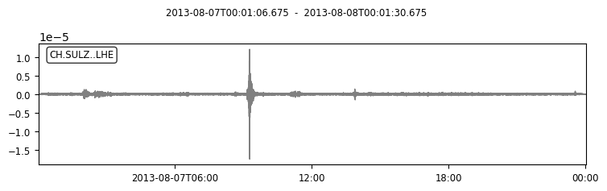
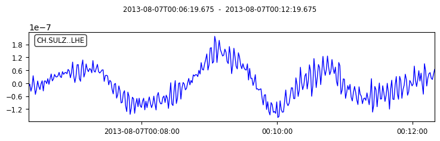
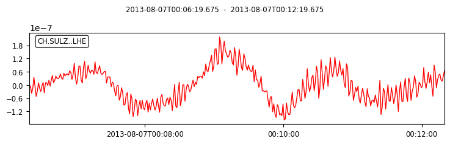

Preprocessing of ocean bottom seismic data
Obstools is an extensive Python package that serves as a comprehensive toolbox for processing ocean bottom seismic and pressure data. It offers a range of preprocessing capabilities, including decimation, glitches removal, removal of local and global earthquakes, tilt correction utilizing three distinct approaches, pressure gauge calibration, and water attraction correction. Moreover, the toolbox provides flexibility by granting access to and allowing modifications to various signal processing methods such as different types of filters, tapering, and numerous useful plots for data analysis.

Despite its user-friendly nature, obstools employs sophisticated calculations and methodologies to ensure highly accurate results. By incorporating intricate techniques, this toolbox ensures the precision and reliability of the processed data.

------------------
Common formats of OBS data are SAC, SEGY and MSEED. Here we show how we can read and write OBS data:
data can be found in the [link](https://github.com/Sarvandani?tab=repositories). 
```python
## reading sac file
from obspy import read
data = read("SULZ.LHE.CH.2013.219.processed.SAC")

```


```python
## plating sac file
data.plot(color='gray')
print(data) 
print(data[0].stats) 
data.plot(outfile= "SAVED.pdf", color='gray')
```


    

    


    1 Trace(s) in Stream:
    CH.SULZ..LHE | 2013-08-07T00:01:06.675000Z - 2013-08-08T00:01:30.675000Z | 1.0 Hz, 86425 samples
             network: CH
             station: SULZ
            location: 
             channel: LHE
           starttime: 2013-08-07T00:01:06.675000Z
             endtime: 2013-08-08T00:01:30.675000Z
       sampling_rate: 1.0
               delta: 1.0
                npts: 86425
               calib: 1.0
             _format: SAC
                 sac: AttribDict({'delta': 1.0, 'depmin': -1.7538265e-05, 'depmax': 1.2107845e-05, 'scale': 1.0, 'b': 0.0, 'e': 86424.0, 'internal0': 2.0, 'stla': 47.52748, 'stlo': 8.11153, 'evla': 0.0, 'evlo': 0.0, 'dist': 0.0, 'depmen': -1.1743592e-11, 'cmpaz': 0.0, 'cmpinc': 0.0, 'nzyear': 2013, 'nzjday': 219, 'nzhour': 0, 'nzmin': 1, 'nzsec': 6, 'nzmsec': 675, 'nvhdr': 6, 'npts': 86425, 'iftype': 1, 'iztype': 9, 'leven': 1, 'lpspol': 1, 'lovrok': 1, 'lcalda': 0, 'kstnm': 'SULZ', 'kcmpnm': 'LHE', 'knetwk': 'CH'})


```python
## reading some part of sac data
import obspy
from obspy.core import UTCDateTime
dt1 = UTCDateTime("2013-08-07T00:06:20")
dt2 = UTCDateTime("2013-08-07T00:12:20")
data_limited = obspy.read("SULZ.LHE.CH.2013.219.processed.SAC", starttime=dt1, endtime=dt2)

```


```python
## Plotting some part of sac data
data_limited.plot(color='blue')
print(data_limited) 
print(data_limited[0].stats) 
```


    

    


    1 Trace(s) in Stream:
    CH.SULZ..LHE | 2013-08-07T00:06:19.675000Z - 2013-08-07T00:12:19.675000Z | 1.0 Hz, 361 samples
             network: CH
             station: SULZ
            location: 
             channel: LHE
           starttime: 2013-08-07T00:06:19.675000Z
             endtime: 2013-08-07T00:12:19.675000Z
       sampling_rate: 1.0
               delta: 1.0
                npts: 361
               calib: 1.0
             _format: SAC
          processing: ['ObsPy 1.4.0: trim(endtime=None::fill_value=None::nearest_sample=True::pad=False::starttime=UTCDateTime(2013, 8, 7, 0, 6, 20))', 'ObsPy 1.4.0: trim(endtime=UTCDateTime(2013, 8, 7, 0, 12, 20)::fill_value=None::nearest_sample=True::pad=False::starttime=None)']
                 sac: AttribDict({'delta': 1.0, 'depmin': -1.7538265e-05, 'depmax': 1.2107845e-05, 'scale': 1.0, 'b': 0.0, 'e': 86424.0, 'internal0': 2.0, 'stla': 47.52748, 'stlo': 8.11153, 'evla': 0.0, 'evlo': 0.0, 'dist': 0.0, 'depmen': -1.1743592e-11, 'cmpaz': 0.0, 'cmpinc': 0.0, 'nzyear': 2013, 'nzjday': 219, 'nzhour': 0, 'nzmin': 1, 'nzsec': 6, 'nzmsec': 675, 'nvhdr': 6, 'npts': 86425, 'iftype': 1, 'iztype': 9, 'leven': 1, 'lpspol': 1, 'lovrok': 1, 'lcalda': 0, 'kstnm': 'SULZ', 'kcmpnm': 'LHE', 'knetwk': 'CH'})


```python
#Writing or extracting data
data_limited.write("data_limited.mseed", format="MSEED")
data_limited.write("data_limited.SAC", format="SAC")


```


```python
#verifying written data
data_NEW = obspy.read("data_limited.SAC")
data_NEW.plot(color='red')
print(data_NEW) 
print(data_NEW[0].stats) 
```


    

    


    1 Trace(s) in Stream:
    CH.SULZ..LHE | 2013-08-07T00:06:19.675000Z - 2013-08-07T00:12:19.675000Z | 1.0 Hz, 361 samples
             network: CH
             station: SULZ
            location: 
             channel: LHE
           starttime: 2013-08-07T00:06:19.675000Z
             endtime: 2013-08-07T00:12:19.675000Z
       sampling_rate: 1.0
               delta: 1.0
                npts: 361
               calib: 1.0
             _format: SAC
                 sac: AttribDict({'delta': 1.0, 'depmin': -1.591153e-07, 'depmax': 2.174798e-07, 'scale': 1.0, 'b': 313.0, 'e': 673.0, 'internal0': 2.0, 'stla': 47.52748, 'stlo': 8.11153, 'evla': 0.0, 'evlo': 0.0, 'dist': 0.0, 'depmen': -1.3091029e-09, 'cmpaz': 0.0, 'cmpinc': 0.0, 'nzyear': 2013, 'nzjday': 219, 'nzhour': 0, 'nzmin': 1, 'nzsec': 6, 'nzmsec': 675, 'nvhdr': 6, 'npts': 361, 'iftype': 1, 'iztype': 9, 'leven': 1, 'lpspol': 1, 'lovrok': 1, 'lcalda': 0, 'kstnm': 'SULZ', 'kcmpnm': 'LHE', 'knetwk': 'CH'})

